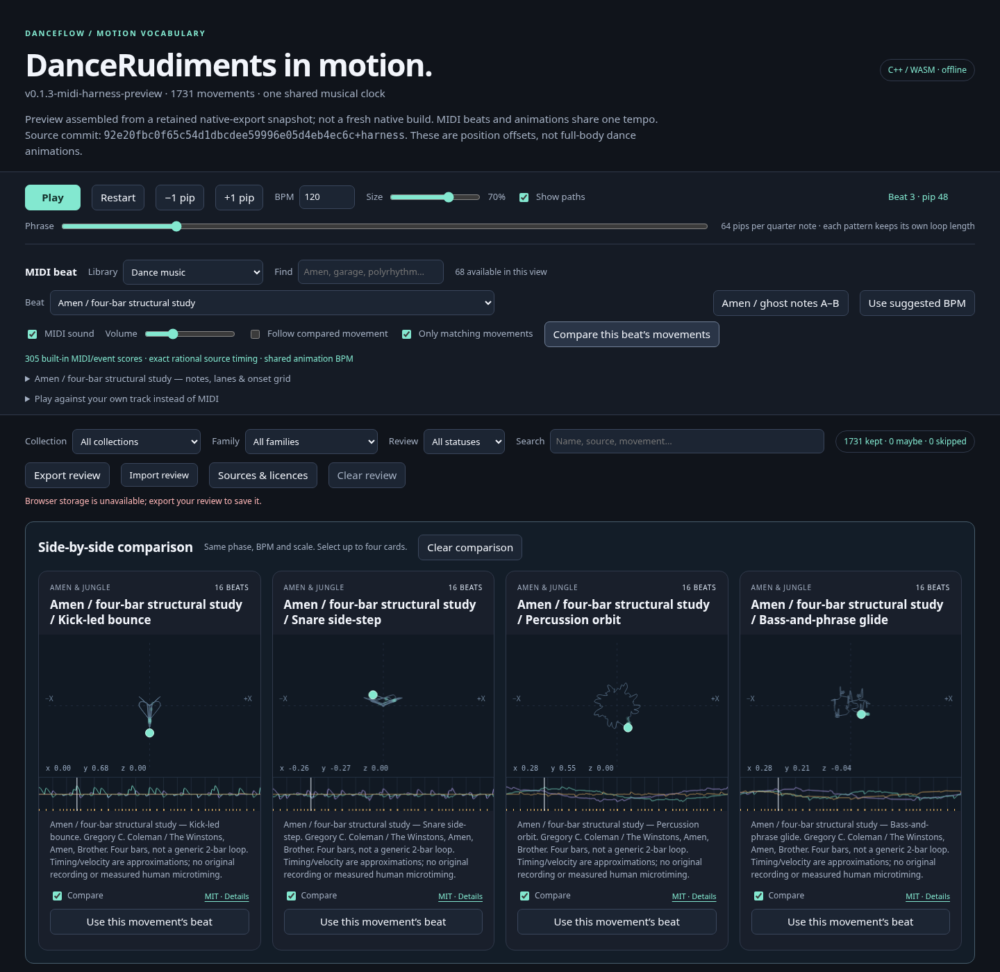
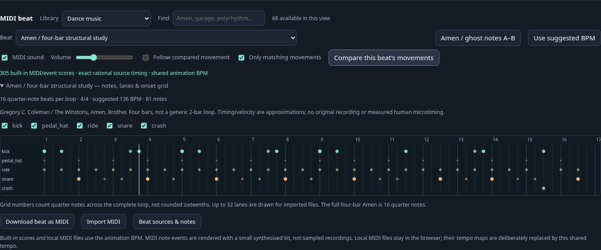
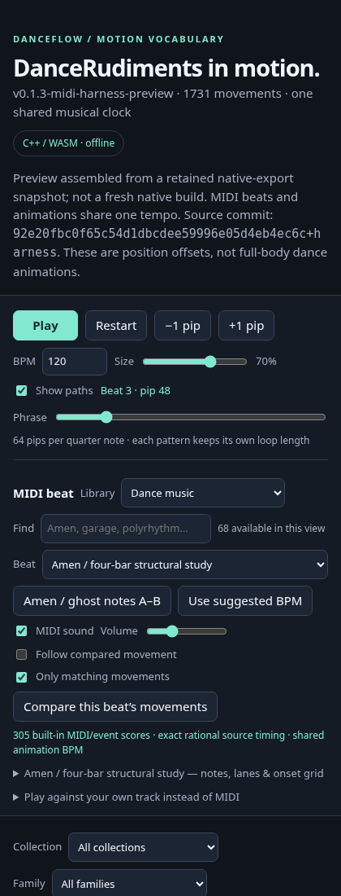

# Language bindings and screenshots

By [Kieran Simkin — My Songs](https://kieransimkin.co.uk/my-songs/).

The [main README](../README.md#language-bindings) contains the complete C++, Python,
C#/.NET, TypeScript and JavaScript instructions. Runnable source is in
[examples/bindings](../examples/bindings/). CMake installs this guide, the README,
examples and screenshots under `share/DanceRudiments`; scikit-build's wheel
includes that CMake installation alongside its Python packages. The Conan package
includes README.md, AUTHORS.md, docs/ and examples/bindings/ at its root. The npm
archive includes the same first-party documentation and examples.

The new [C# guide](csharp.md) covers native loading, custom packs, six-RID NuGet
packaging and trusted publishing. The NuGet package contains its own linked README,
this binding's guide, screenshots, example and author/source notices.

## Visualizer overview



This is a screenshot of the actual checked-in self-contained HTML, not a mock-up
or a separately reimplemented movement. Four related Amen movements were selected,
the transport was set to beat 2.75, and playback was paused for the capture.

## MIDI instrument grid



The instrument grid and selectors are part of the shared-tempo beat player.
The capture did not record audio. Synthesized note playback is distinct from
motion sampling through the C++/WASM engine.

## Mobile layout



These screenshots are documentation snapshots of commit
`47430c1bd63e3336e1bef355875d86c07d327637`, not evidence that a later release has
been deployed. The capture manifest records the viewport and loading mode.

## Reproduce screenshots

With Playwright and Chromium installed, from the repository root:

```sh
python tools/capture_readme_screenshots.py harness/index.html --output docs/images
```

The default path uses file navigation. `--in-memory` is an explicit workaround
for restricted environments and is recorded in `capture.json`; it must not be
reported as a successful local-file navigation test. Captures are never invented
when browser execution fails.

## Registry images versus offline copies

The README uses absolute image URLs so its rendered description can work on PyPI
and npm as well as GitHub once this commit is pushed. This guide uses local paths
so packaged screenshots remain viewable without a network. Examples built from a
checkout may need a newer catalogue than the most recently published version.

## Author metadata contract

The exact music-page URL is retained in Python summary/project URLs and wheel
README/METADATA; npm description/homepage/author and README; the Conan recipe and
packaged README; CMake project metadata, installed README and author credits;
C# NuGet description/project URL and packaged README; and C++ release PACKAGE-INFO.txt. All first-party collection READMEs also carry
it, including those emitted by generators. Original source licences, cryptographic
source identities and numerical movement tables are deliberately untouched.

`tools/check_package_docs.py` checks source metadata or an actual built wheel,
source distribution, npm archive or native ZIP before publication. It does not
claim that an archive has been uploaded. GitHub's hosted About text is repository
configuration, not part of this patch.

## Implementation references

- Emscripten loader and asset location: https://emscripten.org/docs/api_reference/module.html
- Embind ownership and deletion: https://emscripten.org/docs/porting/connecting_cpp_and_javascript/embind.html
- Python project metadata: https://packaging.python.org/en/latest/specifications/pyproject-toml/
- scikit-build/CMake install contents: https://scikit-build-core.readthedocs.io/en/stable/configuration/
- Conan metadata and source export: https://docs.conan.io/2/reference/conanfile/attributes.html
